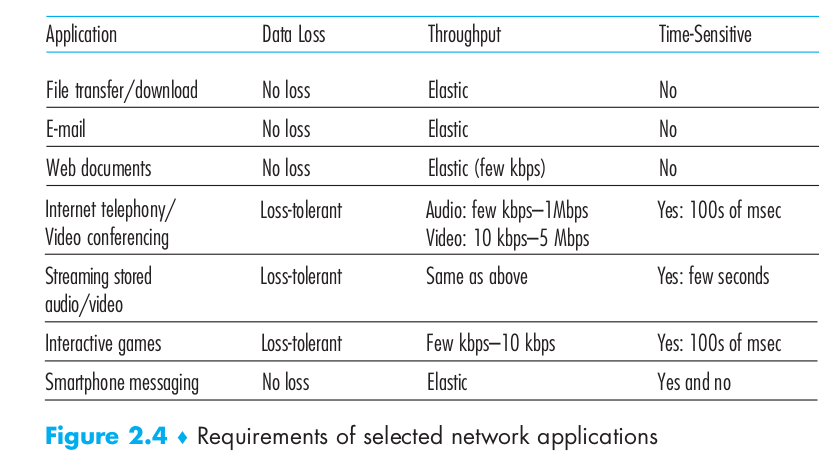
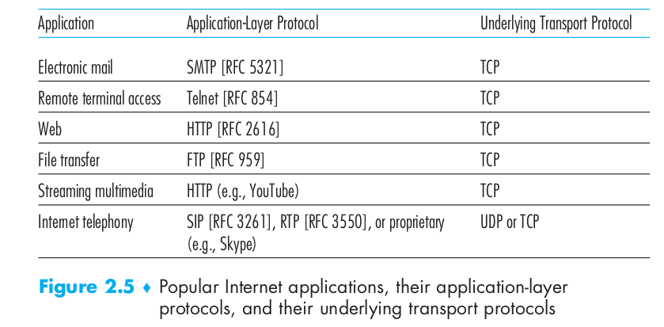

# Chapter 2: Application Layer

**Why start with Application layer ?**

It&#39;s familiar ground. We&#39;re acquainted with many of the applications that rely on the protocols we&#39;ll study. It will give us a good feel for what protocols are all about and will introduce us to many of the same issues that we&#39;ll see again when we study transport, network, and link layer protocols.

## 2.1 Principles of Network Applications

- At the core of network application development is writing programs that run on different end systems and communicate with each other over the network.

- Thus, when developing your new application, you need to write software that will run on multiple end systems.
- This basic design - namely, confining application software to the end systems - has facilitated the rapid development and deployment of a vast array of network applications.

### 2.1.1 Network Application Architectures

- Before diving into software coding, you should have a broad architectural plan for your application.
- An application&#39;s architecture is distinctly different from the network architecture.
- **How is it different ?** The network architecture is fixed and provides a specific set of services to applications. The application architecture, on the other hand, is designed by the application developer and dictates how the application is structured over the various end systems.
- **Two predominant architectural paradigms** : The client-server architecture or The peer-to-peer (P2P) architecture.
- **In a Client-server architecture** , there is an always-on host, called the server, which services requests from many other hosts, called clients.

  - Note that with the client-server architecture, **clients do not directly communicate with each other** (for example, in the Web application, two browsers do not directly communicate.)

  - Another characteristic of the client-server architecture is that **the server has a fixed, well-known address, called an IP address** such that a client can always contact the server by sending a packet to the server&#39;s IP address.

  - **Applications using this architecture** : The Web, FTP, Telnet, and e-mail.

  - Often in a client-server application, a single-server host is incapable of keeping up with all the requests from clients.For this reason, a **data center,** housing a large number of hosts, is often used to create a powerful virtual server.A data center can have hundreds of thousands of servers, which must be powered and maintained. Additionally, the service providers must pay recurring interconnection and bandwidth costs for sending data from their data centers.

- **In a P2P architecture** , there is minimal (or no) reliance on dedicated servers in data centers.

  - Instead the application exploits direct communication between pairs of intermittently connected hosts, called peers. The peers are not owned by the service provider, but are instead desktops and laptops controlled by users, with most of the peers residing in homes, universities, and offices.

  - Because the peers communicate without passing through a dedicated server, the architecture is called **peer-to-peer.**

  - **Applications using this architecture** : BitTorrent, Xunlei,Skype

  - One of the most compelling features of P2P architectures is their **self-scalability.** (For example, in a P2P file-sharing application, although each peer generates workload by requesting files, each peer also adds service capacity to the system by distributing files to other peers.)

  - P2P architectures are also **cost effective** , since they normally don&#39;t require significant server infrastructure and server bandwidth.

  - However, P2P applications **face challenges of security, performance, and reliability due to their highly decentralized structure.**

- Some applications have **hybrid architectures** , combining both client-server and P2P elements. For example, for many instant messaging applications, servers are used to track the IP addresses of users, but user-to-user messages are sent directly between user hosts (without passing through intermediate servers)

### 2.1.2 Processes Communicating

- Before building your network application, you also need a basic understanding of how the programs, running in multiple end systems, communicate with each other.
- It is not actually programs but **processes** that communicate. A process can be thought of as a program that is running within an end system. When processes are running on the same end system, they can communicate with each other with interprocess communication, using rules that are governed by the end system&#39;s operating system.
- However, Processes on two different end systems communicate with each other by **exchanging messages across the computer network**. A sending process creates and sends messages into the network; a receiving process receives these messages and possibly responds by sending messages back.
- A network application **consists of pairs of processes** that send messages to each other over a network. For each pair of communicating processes, we typically label one of the two processes as the client and the other process as the server.
- In the context of a communication session between a pair of processes, the process that initiates the communication (that is, initially contacts the other process at the beginning of the session) is labeled as the client. The process that waits to be contacted to begin the session is the server.
- **Examples:** In the Web, a browser process initializes contact with a Web server process;hence the browser process is the client and the Web server process is the server. In P2P file sharing, when Peer A asks Peer B to send a specific file, Peer A is the client and Peer B is the server in the context of this specific communication session.
- A process sends messages into, and receives messages from, the network through a software interface called a **socket.**
- **Definition:** A socket is the interface between the application layer and the transport layer within a host. It is also referred to as the Application Programming Interface (API) between the application and the network, since the socket is the programming interface with which network applications are built.
- The application developer has control of everything on the application-layer side of the socket but has little control of the transport-layer side of the socket. The only control that the application developer has on the transport-layer side is (1) the choice of transport protocol and (2) perhaps the ability to fix a few transport-layer parameters such as maximum buffer and maximum segment sizes.
- In order for a process running on one host to send packets to a process running on another host, the receiving process needs to have an address.
- To identify the receiving process, two pieces of information need to be specified: (1) **the address of the host** and (2) **an identifier that specifies the receiving process (more specifically, the receiving socket) running in the destination host.**

- In the Internet, the host is identified by its **IP address.** The second information is needed because the host maybe running many network applications. A **destination port number** serves this purpose. Popular applications have been assigned specific port numbers. For example, a Web server is identified by port number 80. A mail server process (using the SMTP protocol) is identified by port number 25.

### 2.1.3 Transport Services Available to Applications

- The application at the sending side pushes messages through the socket. At the other side of the socket, the transport-layer protocol has the responsibility of getting the messages to the socket of the receiving process.
- When you develop an application, you must choose one of the available transport layer protocols with the services that best match your application&#39;s needs.
- What are the services that a transport-layer protocol can offer to applications invoking it? **Reliable data transfer, Throughput, Timing, and Security.**

- **Reliable Data Transfer**
  - A guarantee that the data sent by one end of the application is delivered correctly and completely to the other end of the application. Because packets can get lost within a computer network and because data loss can have devastating consequences for some applications.

  - If a protocol provides such a guaranteed data delivery service, it is said to provide reliable data transfer.

  - **Process-to-process reliable data transfer** means that when a transport protocol provides this service, the sending process can just pass its data into the socket and know with complete confidence that the data will arrive without errors at the receiving process

  - When a transport-layer protocol doesn&#39;t provide reliable data transfer, some of the data sent by the sending process may never arrive at the receiving process. This may be **acceptable for loss-tolerant applications** , most notably multimedia applications such as conversational audio/video that can tolerate some amount of data loss (In these multimedia applications, lost data might result in a small glitch in the audio/video—not a crucial impairment).

- **Throughput**
  - It is the rate at which the sending process can deliver bits to the receiving process.

  - Because other sessions will be sharing the bandwidth along the network path, and because these other sessions will be coming and going, the available throughput can fluctuate with time.Thus, **guaranteed available throughput at some specified rate** is another service that can be provided by transport protocol (application could request a guaranteed throughput of r bits/sec, and the transport protocol would then ensure that the available throughput is always at least r bits/sec).

  - Applications that have throughput requirements are **bandwidth-sensitive applications.** Many current multimedia applications are bandwidth sensitive, although some multimedia applications may use adaptive coding techniques to encode digitized voice or video at a rate that matches the currently available throughput.

  - On the other hand, **elastic applications** can make use of as much, or as little, throughput as happens to be available. Electronic mail, file transfer, and Web transfers are all elastic applications. Of course, the more throughput, the better.

- **Timing**
  - A transport-layer protocol can also provide timing guarantees, timing guarantees can come in many shapes and forms.

  - **Example:** Every bit that the sender pumps into the socket arrives at the receiver&#39;s socket no more than 100 msec later.

  - This is important for **interactive real-time applications**. Long delays in Internet telephony, for example, tend to result in unnatural pauses in the conversation; in a multiplayer game or virtual interactive environment, a long delay between taking an action and seeing the response from the environment makes the application feel less realistic.

  - For **non-real-time applications** , lower delay is always preferable to higher delay, but no tight constraint is placed on the end-to-end delays.

- **Security**
  - A transport protocol can provide an application with one or more security services.

  - **Example:** in the sending host, a transport protocol can encrypt all data transmitted by the sending process, and in the receiving host, the transport-layer protocol can decrypt the data before delivering the data to the receiving process.

  - Such Service would provide confidentiality between the two processes, even if the data is somehow observed between sending and receiving processes.
  - **Another Examples** : Data integrity and end-point authentication.

### 2.1.4 Transport Services Provided by the Internet

The Internet (and, more generally, TCP/IP networks) makes two transport protocols available to applications, UDP and TCP. When you (as an application developer) create a new network application for the Internet, one of the first decisions you have to make is whether to use UDP or TCP. Each of these protocols offers a different set of services to the invoking applications.

- **TCP Services:** The TCP service model includes a connection-oriented service and a reliable data transfer service.

  1. **Connection-oriented service** : TCP has the client and server exchange transport layer control information with each other before the application-level messages begin to flow. This so-called handshaking procedure alerts the client and server, allowing them to prepare for an onslaught of packets. After the handshaking phase, a TCP connection is said to exist between the sockets of the two processes. The connection is a full-duplex connection in that the two processes can send messages to each other over the connection at the same time. When the application finishes sending messages, it must tear down the connection.
  2. **Reliable data transfer service:** The communicating processes can rely on TCP to deliver all data sent without error (no missing or duplicate bytes) and in the proper order.

  3. TCP also includes a **congestion-control mechanism** , a service for the general welfare of the Internet rather than for the direct benefit of the communicating processes. The TCP congestion-control mechanism controls the flow of a sending process (client or server) when the network is congested between sender and receiver. It also attempts to limit each TCP connection to its **fair share of network bandwidth.**

- **UDP Services:** UDP is a no-frills, lightweight transport protocol, providing minimal services.

  - UDP is **connectionless** , so there is no handshaking before the two processes start to communicate.

  - UDP provides an **unreliable data transfer service** —that is, when a process sends a message into a UDP socket, UDP provides no guarantee that the message will ever reach the receiving process. Furthermore, messages that do arrive at the receiving process may arrive out of order.

  - UDP does not include a congestion-control mechanism, so sending side of UDP can pump data into the layer below (the network layer) at any rate it pleases.

- **Services Not Provided by Internet Transport Protocols:**

  - TCP provides reliable end-to-end data transfer. Also, TCP can be easily enhanced at the application layer with SSL to provide security services.

  - Throughput or timing guarantees services not provided by today&#39;s Internet transport protocols. Time-sensitive applications such as Internet telephony often work fairly well because they have been designed to cope, to the greatest extent possible, with this lack of guarantee.Nevertheless, clever design has its limitations when delay is excessive, or the end-to-end throughput is limited. In summary, today&#39;s Internet can often provide satisfactory service to time-sensitive applications, but it cannot provide any timing or throughput guarantees.

  - Developers of Internet telephony applications usually prefer to run their applications over UDP, thereby circumventing TCP&#39;s congestion control mechanism and packet overheads. But because many firewalls are configured to block (most types of) UDP traffic, Internet telephony applications often are designed to use TCP as a backup if UDP communication fails.

- **Some popular applications, their requirements, their application layer protocols and underlying transport protocols**

### 2.1.5 Application-Layer Protocols

An application-layer protocol defines:

1. The types of messages exchanged, for example, request messages and response messages
2. The syntax of the various message types, such as the fields in the message and how the fields are delineated.
3. The semantics of the fields, that is, the meaning of the information in the fields.
4. Rules for determining when and how a process sends messages and responds to messages.

It is important to *distinguish* between network applications and application layer protocols. An application-layer protocol is only one piece of a network application.
**Example is the Web itself**, which is a client-server application that allows users to obtain documents from Web servers on demand. The Web application consists of many components including a standard for document formats (that is, HTML),Web browsers (for example, Firefox and Microsoft Internet Explorer), Web servers (for example, Apache and Microsoft servers), and an application-layer protocol.(HTTP)

## 2.2 The Web and HTTP

- The Web was the first Internet application that caught the general public&#39;s eye.
- The Web operates on demand (Users receive what they want, when they want it).
- The Web uses the **client-server application architecture.**
- The HyperText Transfer Protocol (HTTP), the Web&#39;s application-layer protocol, is at the heart of the Web.
- HTTP is implemented in two programs: a client program and a server program. The client program and server program, executing on different end systems, talk to each other by exchanging HTTP messages. HTTP defines the structure of these messages and how the client and server exchange the messages.
- A Web page (also called a document) consists of objects. An object is simply a file that is addressable by a single URL. Most Web pages consist of a base HTML file and several referenced objects. (No. of Objects = Base + referenced Objects)
- Each URL has two components: hostname of the server that houses the object and the object&#39;s path name.
- Web browsers implement the client side of HTTP,  Web servers implement the server side of HTTP.
- HTTP defines how Web clients request Web pages from Web servers and how servers transfer Web pages to clients.
- HTTP uses TCP as its underlying transport protocol. The HTTP client first initiates a TCP connection with the server. Once the connection is established, the browser and the server processes access TCP through their socket interfaces. (Both client and server send and receive messages through Socket)
- Here we see one of the great advantages of a layered architecture—HTTP need not worry about lost data or the details of how TCP recovers from loss or reordering of data within the network. That is the job of TCP and the protocols in the lower layers of the protocol stack.
- HTTP is said to be a **stateless protocol**. The server sends requested files to clients without storing any state information about the client.

**2.2.2 Non-Persistent and Persistent Connections:**

- **●●** In many Internet applications, the client and server communicate for an extended period of time, with the client making a series of requests and the server responding to each of the requests.
- **●●** When this client-server interaction is taking place over TCP, the application developer needs to make a decision—should each request/response pair be sent over a separate TCP connection, ( **non-persistent connections** ) or should all of the requests and their corresponding responses be sent over the same TCP connection ( **persistent connections** ) ?
- **●●** Although HTTP uses persistent connections in its default mode, HTTP clients and servers can be configured to use non-persistent connections instead.
- **●●**** HTTP with Non-Persistent Connections:** Let&#39;s suppose the page consists of a base HTML file and 10 JPEG images, and that all 11 of these objects reside on the same server. each TCP connection transports exactly one request message and one response message. Thus, in this example, when a user requests the

Web page, 11 TCP connections are generated.

- **●●**** Definition:** The round-trip time (RTT), which is the time it takes for a small packet to travel from client to server and then back to the client. The RTT includes packet-propagation delays, packet queuing delays in intermediate routers and switches, and packet-processing delays.

&quot;Three-way handshake&quot;—the client sends a small TCP segment to the server, the server acknowledges and responds with a small TCP segment, and, finally, the client acknowledges back to the server. The first two parts of the three-way handshake take one RTT. After completing the first two parts of the handshake, the client sends the HTTP request message combined with the third part of the three-way handshake (the acknowledgment) into the TCP connection. Once the request message arrives at the server, the server sends the HTML file into the TCP connection. This HTTP request/response eats up another RTT. Thus, roughly, the total response time is two RTTs plus the transmission time at the server of the HTML file.

**Disadvantages:** First, a brand-new connection must be established and maintained for each requested object. For each of these connections, TCP buffers must be allocated and TCP variables must be kept in both the client and server. This can place a significant burden on the Web server, which may be serving requests from hundreds of different clients simultaneously.

Second, each object suffers a delivery delay of two RTTs—one RTT to establish the TCP connection and one RTT to request and receive an object.

- **●●**** HTTP with Persistent Connections:**

With HTTP 1.1 persistent connections, the server leaves the TCP connection open after sending a response. Subsequent requests and responses between the same client and server can be sent over the same connection.

The same Web page example given can be sent over a single persistent TCP connection.

Moreover, multiple Web pages residing on the same server can be sent from the server to the same client over a single persistent TCP connection.

These requests for objects can be made back-to-back, without waiting for replies to pending requests (pipelining).

Typically, the HTTP server closes a connection when it isn&#39;t used for a certain time (a configurable timeout interval).

**2.2.3 HTTP Message Format:**

There are two types of HTTP messages, request messages and response messages.

- **●●**** HTTP Request Message:**

        GET /somedir/page.html HTTP/1.1        //called the request line

Host: [www.someschool.edu](http://www.someschool.edu)                //specifies the host on which the object resides

Connection: close                                //close the connection after sending object

User-agent: Mozilla/5.0                        //specifies the browser type

Accept-language: fr                        //indicates that the user prefers this language

First of all, message is written in **ordinary ASCII text** , so that your ordinary computer-literate human being can read it.

Second, each line is followed by a carriage return and a line feed. The last line is fol-

lowed by an additional carriage return and line feed.A request message can have many more lines or as few as one line.

1- The **request line** has **three fields** : the **method field, the URL field, and the HTTP version field**.

2- The method field can take on several different values, including **GET, POST, HEAD, PUT, and DELETE.**

3- The **requested object** is identified in the **URL field.**

4- Each header line is used to specify an information needed as shown above.

5- The **entity body** is empty with the GET method, but is used with the POST method. An HTTP client often uses the POST method when the user fills out a form. With a POST message, the user is still requesting a Web page from the server, but the specific contents of the Web page depend on what the user entered into the form fields and the entity body contains what the user entered into the form fields. Note, HTML forms often use the GET method and include the inputted data (in the form fields) in the requested URL.

6- The **HEAD method** is similar to the GET method. When a server receives a

request with the HEAD method, it responds with an HTTP message but it leaves out

the requested object. Application developers often use the HEAD method for debugging.

7- The **PUT method** is often used in conjunction with Web publishing tools. It allows a user to upload an object to a specific path (directory) on a specific Web server. The PUT method is also used by applications that need to upload objects to Web servers.

8- The **DELETE method** allows a user, or an application, to delete an object on a Web server.

- **●●**** HTTP Response Message:**

HTTP/1.1 200 OK

Connection: close                        //going to close  TCP conn.  after sending message

Date: Tue, 18 Aug 2015 15:44:04 GMT                        //time and date

Server: Apache/2.2.3 (CentOS)                                //indicates the server

Last-Modified: Tue, 18 Aug 2015 15:11:03 GMT       //time and date of last modified.

Content-Length: 6821                                       //number of bytes in the object.

Content-Type: text/html                                     //indicates object type

(data data data data data ...)

It has three sections: **an initial status line, six header lines, and then the entity body.** The entity body contains the requested object itself.

The status line has **three fields** : the **protocol version field, a status code, and a corresponding status message.**

The **status code and associated phrase** indicate the result of the request. Some common status codes and associated phrases include:

- 200 OK: Request succeeded and the information is returned in the response.
- 301 Moved Permanently: Requested object has been permanently moved; the new URL is specified in Location: header of the response message. The client software will automatically retrieve the new URL.

- 400 Bad Request: This is a generic error code indicating that the request could not be understood by the server.
- 404 Not Found: The requested document does not exist on this server.
- 505 HTTP Version Not Supported: The requested HTTP protocol version is not supported by the server.

The **Last-Modified: header** is critical for object caching.

The **Date: header** indicates  the time when the server retrieves the object from its file system, inserts the object into the response message, and sends the response message and not the time when the object was created or last modified.

The HTTP specification defines many more header lines that can be inserted by browsers, Web servers, and network cache servers.

We have covered only a small number of the totality of header lines.

**2.2.4 User-Server Interaction: Cookies:**

- **●●** As mentioned, HTTP server is stateless. This simplifies server design and has permitted engineers to develop high-performance Web servers that can handle thousands of simultaneous TCP connections.
- **●●** However, it is often desirable for a Web site to identify users, either because the server wishes to restrict user access or because it wants to serve content as a function of the user identity.
- **●●** For these purposes, HTTP uses cookies. **Cookies, allow sites to keep track of users.** Most major commercial Web sites use cookies today.
- **●●** Cookie technology has four components:

(1) A cookie header line in the HTTP response message.

(2) A cookie header line in the HTTP request message.

(3) A cookie file kept on the user&#39;s end system and managed by the user&#39;s browser.

(4) A back-end database at the Web site.

- **●●** Although cookies often simplify the Internet shopping experience for the user,they are controversial because they can also be considered as an invasion of privacy. Using a combination of cookies and user-supplied account information, a Web site can learn a lot about a user and potentially sell this information to a third party.
- **●●**** Example on Cookies Usage:**

Suppose Susan, contacts Amazon.com for the first time. Let us suppose that in the past she has already visited the eBay site.

1- When the request comes into the Amazon Web server, the server creates a unique

identification number and creates an entry in its back-end database that is indexed

by the identification number.

2- The Amazon Web server then responds to Susan&#39;s browser, including in the HTTP response a Set-cookie: header, which contains the identification number.

3- When Susan&#39;s browser receives the HTTP response message, it sees the Set-cookie: header. The browser then appends a line to the special cookie file that it manages. This line includes the hostname of the server and the identification number in the Set-cookie: header.

4- As Susan continues to browse the Amazon site, each time she requests a Web page, her browser consults her cookie file, extracts her identification number for this site, and puts a cookie header line that includes the identification number in the HTTP request.

5- the Amazon server is able to track Susan&#39;s activity at the Amazon site. Although the Amazon Web site does not necessarily know Susan&#39;s name, it knows exactly which pages user 1678 visited, in which order, and at what times!

From this discussion we see that cookies can be used to identify a user. The first time a user visits a site, the user can provide a user identification. During the subsequent sessions, the browser passes a cookie header to the server, thereby identifying the user to the server. **Cookies can thus be used to create**

**a user session layer on top of stateless HTTP.**

**2.2.5 Web Caching:**

A **Web cache—also called a proxy server** —is a network entity that satisfies HTTP

requests on the behalf of an origin Web server. The Web cache has its own disk

storage and keeps copies of recently requested objects in this storage.

- A user&#39;s browser can be configured so that all of the user&#39;s HTTP requests are first directed to the Web cache.

**Example 1 on Web Caching Usage:**

Suppose a browse is requesting the object http://www.someschool.edu/campus.gif.

1. The browser establishes a TCP connection to the Web cache and sends an HTTP request for the object to the Web cache.

2. The Web cache checks to see if it has a copy of the object stored locally. If it does, the Web cache returns the object within an HTTP response message to the client browser.

3. If the Web cache does not have the object, the Web cache opens a TCP connection to the origin server, that is, to www.someschool.edu. The Web cache then sends an HTTP request for the object into the cache-to-server TCP connection. After receiving this request, the origin server sends the object within an HTTP response to the Web cache.

4. When the Web cache receives the object, it stores a copy in its local storage and

sends a copy, within an HTTP response message, to the client browser (over the

existing TCP connection between the client browser and the Web cache).

- Note that a cache is both a server and a client at the same time. When it receives requests from and sends responses to a browser, it is a server. When it sends requests to and receives responses from an origin server, it is a client.
- Typically a Web cache is purchased and installed by an ISP,  but this cost is low—many caches use public-domain software that runs on inexpensive PCs.
- Web cache can substantially reduce the response time for a client request, particularly if the bottleneck bandwidth between the client and the origin server is much less than the bottleneck bandwidth between the client and the cache. If there is a high-speed connection between the client and the cache, as there often is, and if the cache has the requested object, then the cache will be able to deliver the object rapidly to the client.
- Web caches can substantially reduce traffic on an institution&#39;s access link to the Internet. By reducing traffic, the institution (for example, a company or a university) does not have to upgrade bandwidth as quickly, thereby reducing costs.
- Web caches can substantially reduce Web traffic in the Internet as a whole, thereby improving performance for all applications.

**Example 2 on Web Caching Usage:**

- **●●** This figure shows two networks—the institutional network and the rest of the public Internet. The institutional network is a high-speed LAN. A router in the institutional network and a router in the Internet are connected by a 15 Mbps link.
- **●●** Suppose that the average object size is 1 Mbits and that the average request rate from the institution&#39;s browsers to the origin servers is 15 requests per second.
- **●●** HTTP request messages are negligibly small and thus create no traffic in the networks or in the access link
- **●●** Also Suppose RTT from institutional router to any origin server: 2 sec. (Internet delay)
- **●●** The total response time = LAN delay + Access delay(that is, the delay between the two routers) + Internet delay.
- **●●** The traffic intensity on LAN =  (15 requests/sec) \* (1 Mbits/request)/(100 Mbps)  = 0.15
- **●●** The Traffic intensity on the access link (from the Internet router to institution router) = (15 requests/sec) \* (1 Mbits/request)/(15 Mbps) = 1
- **●●** The delay on a link becomes very large and grows without bound.Thus, the average response time to satisfy requests is going to be on the order of minutes, if not more, which is unacceptable for the institution&#39;s users. Clearly something must be done.
- **●●** One possible solution is to increase the access rate from 15 Mbps to, say, 100 Mbps. This will lower the traffic intensity on the access link to 0.15, which translates to negligible delays between the two routers. In this case, the total response time will roughly be two seconds, that is, the Internet delay. But this solution also means that the institution must upgrade its access link from 15 Mbps to 100 Mbps, a costly proposition.
- **●●** A better solution is Web Caching, Hit rates—the fraction of requests that are satisfied by a cache typically range from 0.2 to 0.7 in practice. let&#39;s suppose that the cache provides a hit rate of 0.4 for this institution. 40 percent of the requests will be satisfied almost immediately, say, within 10 milliseconds, by the cache but the remaining 60 percent of the requests still need to be satisfied by the origin servers.the traffic intensity on the access link is reduced from 1.0 to 0.6. Typically, a traffic intensity less than 0.8 corresponds to a small delay. This delay is negligible compared with the two-second Internet delay. Given these considerations, average delay therefore is 0.4 \* (0.01 seconds) + 0.6 \* (2.01 seconds) which is just slightly greater than 1.2 seconds.   **Better !**
- **●●**** The Conditional GET:** Although caching can reduce user-perceived response times, it introduces a new problem. the object housed in the Web server may have been modified since the copy was cached at the client.
- **●●** HTTP has **conditional GET** which isa mechanism that allows a cache to verify that its objects are up to date.
- **●●** An HTTP request message is a so-called conditional GET message if

(1)The request message uses the **GET method.**

(2) the request message includes an **If-Modified-Since: header line.**

- **●●** Note that the value of the If-modified-since: header line is exactly equal to the value of the Last-Modified: header line that was sent by the server last time this object was requested and saved in the cache.
- **●●** This conditional GET is telling the server to send the object only if the object has been modified since the specified date.
- **●●** Suppose the object has not been modified since that last date Then, fourth, the Web server sends a response message to the cache with header : &quot;HTTP/1.1 304 Not Modified&quot; and empty entity body, , which tells the cache that it can go ahead and forward its cached copy of the object to the requesting browser.

**2.3 Electronic Mail in the Internet:**

- **●●** At a high level view, it has three major components: **user agents, mail servers, and the SMTP** ( heart of Internet electronic mail).
- **●●** Microsoft Outlook and Apple Mail are examples of **user agents** for e-mail.
- **●●**** Mail servers** form the core of the email infrastructure. Each recipient, has a mailbox located in one of the mail servers. A mailbox manages and maintains the messages that have been sent to recipient.
- **●●**** Lifecycle of a message:** A typical message starts its journey in the sender&#39;s user agent, travels to the sender&#39;s mail server, and travels to the recipient&#39;s mail server, where it is deposited in the recipient&#39;s mailbox.
- **●●** If Alice&#39;s server cannot deliver mail to Bob&#39;s server, Alice&#39;s server holds the message in a message queue and attempts to transfer the message later. Reattempts are often done every 30 minutes or so; if there is no success after several days, the server removes the message and notifies the sender (Alice) with an e-mail message.
- **●●**** SMTP** is the principal application-layer protocol for Internet electronic mail. It uses the reliable data transfer service of TCP to transfer mail from the sender&#39;s mail server to the recipient&#39;s mail server.
- **●●**** SMTP has two sides**: a client side, which executes on the sender&#39;s mail server, and a server side, which executes on the recipient&#39;s mail server.
- **●●**** Both the client and server sides of SMTP run on every mail server**. When a mail server sends mail to other mail servers,it acts as an SMTP client. When a mail server receives mail from other mail servers,it acts as an SMTP server.

**2.3.1 SMTP (Simple Mail Transfer Protocol):**

- **●●** SMTP transfers messages from senders&#39; mail servers to recipients&#39; mail servers.
- **●●** It restricts the body of all mail messages to simple 7-bit ASCII.But today, in the multimedia era, the 7-bit ASCII restriction is a bit of a pain—it requires binary multimedia data to be encoded to ASCII before being sent over SMTP; and it requires the corresponding ASCII message to be decoded back to binary after SMTP transport.
- **●●**** Basic Operation of SMTP:  **

**Step 1, Establish Connection:** the client SMTP (running on the sending mail server host) has TCP establish a connection to port 25 at the server SMTP (running on the receiving mail server host). If the server is down, the client tries again later.

**Step 2, Handshaking phase:** SMTP clients and servers introduce themselves before transferring information. The SMTP client indicates the e-mail address of the sender and the e-mail address of the recipient.

**Step3, Send:** the client sends the message. SMTP can count on the reliable data transfer service of TCP to get the message to the server without errors. The client then repeats this process over the same TCP connection if it has other messages to send to the server; otherwise, it instructs TCP to close the connection.

**Example transcript of messages exchanged between an SMTP client (C) and an SMTP server (S):**

- **●●** Client issued five commands: **HELO, MAIL FROM, RCPT TO, DATA, and QUIT.**
- **●●** A line consisting of a **single period** ,indicates the end of the message to server.
- **●●** The server issues replies to each command,with each reply having a reply code and some (optional) English-language explanation.
- **●●** We mention here that SMTP uses **persistent connections.**
- **●●** SMTP does not normally use intermediate mail servers for sending mail, even when the two mail servers are located at opposite ends of the world.

**2.3.2 Comparison with HTTP:**

- HTTP transfers files (also called objects) from a Web server to a Web client (typically a browser); SMTP transfers files (that is, e-mail messages) from one mail server to another mail server
- Both persistent HTTP and SMTP use persistent connections.
- First difference is First, HTTP is mainly a **pull protocol** —someone loads information on a Web server and users use HTTP to pull the information from the server at their convenience. In particular, the TCP connection is initiated by the machine that wants to receive the file.
- On the other hand, SMTP is primarily a **push protocol** —the sending mail server pushes the file to the receiving mail server. In particular, the TCP connection is initiated by the machine that wants to send the file.
- A second difference, is that SMTP requires each message, including the body of each message, to be in 7-bit ASCII format.HTTP data does not impose this restriction.
- A third important difference concerns how a document consisting of text and images (along with possibly other media types) is handled. HTTP encapsulates each object in its own HTTP response message. SMTP places all of the message&#39;s objects into one message.

**2.3.3 Mail Message Formats:**

1. A **header** containing peripheral information precedes the body of the message.
2. The **header lines** and the **body of the message are separated by a blank line.**
3. As with HTTP, **each header line contains readable text** , consisting of a keyword followed by a colon followed by a value. Some of the keywords are required and others are optional.
4. Every header **must have a From: header line and a To: header line** ; a header may include a Subject: header line as well as other optional header lines.

**2.3.4 Mail Access Protocols:**

- Throughout the discussion, we assumed that Bob reads his mail by logging onto the server host and then executing a mail reader that runs on that host. But today, mail access uses a client-server architecture—the typical user reads email with a client that executes on the user&#39;s end system.
- If Bob&#39;s mail server were to reside on his local PC, then Bob&#39;s PC would have to remain always on, and connected to the Internet, in order to receive new mail, which can arrive at any time. This is impractical for many Internet users.
- Instead, a typical user runs a user agent on the local PC but accesses its mailbox stored on an always-on shared mail server. This mail server is shared with other users and is typically maintained by the user&#39;s ISP.
- There is a **two-step procedure.** SMTP is used to transfer mail from the sender&#39;s mail server to the recipient&#39;s mail server; SMTP is also used to transfer mail from the sender&#39;s user agent to the sender&#39;s mail server.
- Also, **A mail access protocol,** is used to transfer mail from the recipient&#39;s mail server to the recipient&#39;s user agent.

- **POP3:** is an extremely simple mail access protocol.

- --POP3 begins when the user agent (the client) opens a TCP connection to the mail server (the server) on port 110.

- **--** POP3 progresses through three phases: authorization, transaction, and update.
- **--** During the first phase, authorization, the user agent sends a username and a password to authenticate the user.
- **--** During the second phase, transaction, the user agent retrieves messages; also during this phase, the user agent can mark messages for deletion, remove deletion marks, and obtain mail statistics.
- **--** The third phase, update, occurs after the client has issued the quit command, ending the POP3 session; at this time, the mail server deletes the messages that were marked for deletion.
-
**--** In a POP3 transaction, the user agent issues commands, and the server responds to each command with a reply. **There are two possible responses: +OK** (sometimes followed by server-to-client data), used by the server to indicate that the previous command was fine; **and -ERR,** used by the server to indicate that something was wrong with the previous command.

- **--**** The authorization phase has two principal commands: user \&lt;username\&gt; and pass \&lt;password\&gt;.**
- **--** A user agent using POP3 can often be configured (by the user) to **&quot;download and delete&quot;** or to **&quot;download and keep&quot;.** The sequence of commands issued by a POP3 user agent depends on which of these two modes the user agent is operating in.
- **--** In the download-and-delete mode, the user agent will issue **the list, retr, and dele commands.**
- **--** In the download-and-keep mode, the user agent leaves the messages on the mail server after downloading them. (check on different machines)
- **--** During a POP3 session between a user agent and the mail server, the POP3 server maintains some state information (user messages have been marked deleted).
- **--** However, the POP3 server does not carry state information across POP3 sessions. This lack of state information across sessions greatly simplifies the implementation of a POP3 server.

- **●●**** IMAP:** IMAP is a mail access protocol. It has many more features than POP3, but it is also significantly more complex.
- **●●** The IMAP protocol provides commands to allow users to **create folders** and move messages from one folder to another. Also, commands to search these folders.
- **●●** Unlike POP3, an IMAP server **maintains user state information** across IMAP sessions
- **●●** It has commands that permit a user agent to **obtain components of messages** which is useful when there is a low-bandwidth connection.
- **●●**** Web-Based Email:**More and more users today are sending and accessing their email through their Web browsers.
- **●●** The user agent is an ordinary Web browser, and the user communicates with its remote mailbox via HTTP protocol rather than the POP3 or IMAP protocol.

**2.4 DNS—The Internet&#39;s Directory Service:**

Just as humans can be identified in many ways, so too can Internet hosts. One **identifier for a host is its hostname** such as www.facebook.com,www.google.com, gaia.cs.umass.edu..However, hostnames **provide little, if any, information about the location** within the Internet of the host.

Furthermore, because hostnames can consist of **variable-length alphanumeric** characters, they would be difficult to process by routers. **For these reasons, hosts are also identified by so-called IP addresses.**

An IP address consists of **four bytes** and has a **rigid hierarchical structure** because as we scan the address from left to right, we obtain more and more specific information about where the host is located in the Internet. An IP address looks like 121.7.106.83, where each period separates one of the bytes expressed in decimal notation from 0 to 255. An IP address is hierarchical

**2.4.1 Services Provided by DNS**

People prefer the more mnemonic hostname identifier, while routers prefer fixed-length, hierarchically structured IP addresses.

So, the main task of the Internet&#39;s domain name system (DNS) is **providing a directory service that translates hostnames to IP addresses.**

-  DNS is a distributed database implemented in a hierarchy of DNS servers.
- DNS is an application-layer protocol that allows hosts to query the distributed database.
- DNS servers are often UNIX machines running the Berkeley Internet Name Domain (BIND) software.
- DNS protocol runs over UDP and uses port 53.
- DNS is commonly employed by other application-layer protocols—including HTTP and SMTP to translate user-supplied hostnames to IP addresses.
- DNS adds an additional delay to the Internet applications that use it.

**Scenario using DNS:  ** _HTTP client requests the URLwww.someschool.edu/index.html._

1. The same user machine runs the client side of the DNS application.

2. The browser extracts the hostname, www.someschool.edu, from the URL and passes the hostname to the client side of the DNS application.

3. The DNS client sends a query containing the hostname to a DNS server.

4. The DNS client eventually receives a reply, which includes the IP address for the hostname.

5. Once the browser receives the IP address from DNS, it can initiate a TCP connection to the HTTP server process located at port 80 at that IP address.

**DNS provides a few other important services in addition to translating host-**

**names to IP addresses:**

- **●●**** Host aliasing:** A host with a complicated hostname can have one or more alias names.

Alias hostnames, when present, are typically more mnemonic than canonical hostnames. DNS can be invoked by an application to obtain this canonical hostname.

- **●●**** Mail server aliasing:** It is highly desirable that e-mail addresses be mnemonic.

DNS can be invoked by a mail application to obtain the canonical hostname for a supplied alias hostname as well as the IP address of the host.

- **●●**** Load distribution: **DNS is also used to perform load distribution among replicated servers.For replicated Web servers, a set of IP addresses is thus associated with one canonical hostname. The** DNS database **contains this set of IP addresses. When clients make a DNS query for a name mapped to a set of addresses, the server responds with the entire set of IP addresses, but** rotates the ordering of the addresses **within each reply. Because a client typically sends its HTTP request message to the IP address that is listed first in the set,** DNS rotation distributes the traffic among the replicated servers.**

DNS rotation is also used for email so that multiple mail servers can have the same alias name.

**2.4.2 Overview of How DNS Works:**

- **●●** On many UNIX-based machines, gethostbyname() is the function call that an application calls in order to perform the translation
- **●●** From the perspective of the invoking application in the user&#39;s host, DNS is a black box providing a simple, straightforward translation service. But in fact, the black box that implements the service is complex, consisting of a large number of DNS servers distributed around the globe, as well as an application-layer protocol that specifies how the DNS servers and querying hosts communicate.
- **●●**** Centralized Design of DNS:**

Clients simply direct all queries to the single DNS server, and the DNS server responds directly to the querying clients. Although the simplicity of this design is attractive, a centralized database in a single DNS server simply doesn&#39;t scale.The problems with a centralized design include:

• A single point of failure. If the DNS server crashes, so does the entire Internet!

• Traffic volume. A single DNS server would have to handle all DNS queries (for

all the HTTP requests and e-mail messages generated from hundreds of millions

of hosts).

• Distant centralized database. A single DNS server cannot be &quot;close to&quot; all the

querying clients.This can lead to significant delays.

• Maintenance. The single DNS server would have to keep records for all Internet

hosts. Not only would this centralized database be huge, but it would have to be

updated frequently to account for every new host.

- **●●**** A Distributed, Hierarchical Database:** To deal with the issue of scale, the DNS uses a large number of servers, organized in a hierarchical fashion and distributed around the world.
- **●●**** There are three classes of DNS servers—root DNS servers, top-level domain (TLD) DNS servers, and authoritative DNS servers.**

- **●●** Suppose a DNS client wants to determine the IP address for the hostname www.amazon.com.

- --Client first contacts one of the root servers, which returns IP addresses for TLD servers for the top-level domain com.
- --The client then contacts one of these TLD servers, which returns the IP address of an authoritative server for amazon.com.
- --Then, the client contacts one of the authoritative servers for amazon.com, which returns the IP address for the hostname www.amazon.com.

- **●●** _Root DNS servers:_ There are over 400 root name servers scattered all over the world.The full list of root name servers, along with the organizations that manage them and their IP addresses can be found at [Root Servers 2016].
- **●●** _Top-level domain (TLD) servers:_ For each of the top-level domains — top-level domains such as com, org, net, edu, and gov, and all of the country top-level domains such as uk, fr, ca, and jp — there is TLD server (or server cluster)
- **●●** _Authoritative DNS servers:_  An organization&#39;s authoritative DNS server houses these DNS records that map the names of those hosts to IP addresses. An organization can choose to implement its own authoritative DNS server to hold these records, or can pay to have these records stored in an authoritative DNS server of some service provider.

- **●●** There is another important type of DNS server called **the local DNS server**. A local DNS server does not strictly belong to the hierarchy of servers. A host&#39;s local DNS server is typically &quot;close to&quot; the host. Each ISP has a local DNS server (also called a default name server). When a host connects to an ISP, the ISP provides the host with the IP addresses of one or more of its local DNS servers.
- **●●** When a host makes a DNS query, the query is sent to the local DNS server, which acts a proxy, forwarding the query into the DNS server hierarchy.

_Note that in this example, in order to obtain the_ **mapping for one**

**hostname, eight DNS messages were sent:** _four query messages and four reply messages!_

_Our previous example_ **assumed that the TLD server knows the authoritative DNS server** _for the hostname. In general this not always true. Instead, the TLD server may know only of an intermediate DNS server, which in turn knows the authoritative DNS server for the hostname._

_The query sent from_ _cse.nyu.edu_ _to_ _dns.nyu.edu_ _is a_ **recursive query** _, since the query asks dns.nyu.edu to obtain the mapping_

_on its behalf. But the subsequent three queries are_ **iterative queries** _since all of the replies are directly returned to_ _dns.nyu.edu._

- In practice, the queries typically follow the pattern in Figure 2.19: The query from the requesting host to the local DNS server is recursive, and the remaining queries are iterative.

- **●●**** DNS Caching:**

- --DNS extensively exploits DNS caching in order to improve the delay performance and to reduce the number of DNS messages around the Internet.

- --In a query chain, when a DNS server receives a DNS reply (containing, for example, a mapping from a hostname to an IP address), it can cache the mapping in its local memory.

- --If a hostname/IP address pair is cached in a DNS server and another query arrives to the DNS server for the same hostname, the DNS server can provide the desired IP address, even if it is not authoritative for the hostname.
- --Because hosts and mappings between hostnames and IP addresses are by no means permanent, DNS servers discard cached information after a period of time (often set to two days).
- --A local DNS server can also cache the IP addresses of TLD servers, thereby allowing the local DNS server to bypass the root DNS servers in a query chain. In fact, because of caching, root servers are bypassed for all but a very small fraction of DNS queries.

**2.5 Peer-to-Peer File Distribution:**

With a P2P architecture, there is minimal (or no) reliance on always-on infrastructure servers. Instead, pairs of connected hosts, called peers, communicate directly with each other. In this section we consider a very natural P2P application, namely, distributing a large file from a single server to a large number of hosts (called peers).

- In P2P file distribution, each peer can redistribute any portion of the file it has received to any other peers, thereby assisting the server in the distribution process.
- As of 2016, the most popular P2P file distribution protocol is BitTorrent.

**Scalability of P2P Architectures:**

- The server and the peers are connected to the Internet with access links.
-  : upload rate of the server&#39;s access link.
- :  upload rate of the ith peer&#39;s access link.
- :  download rate of the ith peer&#39;s access link.
- : download rate of the peer with the lowest download rate.
-  F :   size of the file to be distributed (in bits).
- N: number of peers that want to obtain a copy of the file.
- The **distribution time** is the time it takes to get a copy of the file to all N peers.
- :  distribution time for the client-server architecture.
- :  distribution time for the peer-to-peer architecture.

Analysis of Client Server Architecture:

- The server must transmit one copy of the file to each of the N peers. Thus the server must transmit NF bits. Since the server&#39;s upload rate is  , the time to distribute the file must be at least NF/
-
●●The peer with the lowest download rate cannot obtain all F bits of the file in less than F/ seconds. Thus the minimum distribution time is at least F/

- This provides a lower bound on the minimum distribution time for the client-server architecture.
- The distribution time increases linearly with the number of peers N.

Analysis of P2P Architecture:

- When a peer receives some file data, it can use its own upload capacity to redistribute the data to other peers.
- At the beginning of the distribution, only the server has the file. To get this file
- into the community of peers, the server must send each bit of the file at least once into its access link. Thus, the minimum distribution time is at least F/
- The peer with the lowest download rate cannot obtain all F bits of the file in less than F/ seconds.
-
●●Finally, observe that the total upload capacity of the system as a whole is equal to the upload rate of the server plus the upload rates of each of the individual peers. The system must deliver (upload) F bits to each of the N peers, thus delivering a total of NF bits. This cannot be done at a rate faster than

- For the client-server architecture, the distribution time increases linearly and without bound as the number of peers increases.
- However, for the P2P architecture, the minimal distribution time is not only always less than the distribution time of the client-server architecture; it is also less than one hour for any number of peers N.
- Thus, applications with the P2P architecture can be self-scaling which is a direct consequence of peers being redistributors as well as consumers of bits.

**BitTorrent:**

- **●●** The collection of all peers participating in the distribution of a particular file is called a torrent.
- **●●** Peers in a torrent download equal-size chunks of the file from one another, with a typical chunk size of 256 kbytes.
- **●●** When a peer first joins a torrent, it has no chunks. Over time it accumulates more and more chunks. While it downloads chunks it also uploads chunks to other peers.
- **●●** Once a peer has acquired the entire file, it may (selfishly) leave the torrent, or (altruistically) remain in the torrent and continue to upload chunks to other peers.
-
**●●** Also, any peer may leave the torrent at any time with only a subset of chunks, and later rejoin the torrent
- **●●** Each torrent has an infrastructure node called a tracker.
- **●●** When a peer joins a torrent, it registers itself with the tracker and periodically informs the tracker that it is still in the torrent.
- **●●** The tracker keeps track of the peers that are participating in the torrent.
- **●●**** Requesting Chunks:** at any given time, different peers have different subsets of file chunks periodically, Alice asks each peer for list of chunks that they have Alice requests missing chunks from peers, rarest first and then request those rarest chunks first. In this manner, the rarest chunks get more quickly redistributed, aiming to (roughly) equalize the numbers of copies of each chunk in the torrent.
- **●●**** Sending Chunks: **** TIT-FOR-TAT ****:** Alice sends chunks to those four peers currently sending her chunks at highest rate. Then, Re-evaluate top 4 every 10 secs. And, Every 30 secs: randomly select another peer, say &quot;Bob&quot;, starts sending chunks and &quot;optimistically un-choke&quot; this peer, Because Alice is sending data to Bob, she may become one of Bob&#39;s top four uploaders.
- **●●** If the two peers are satisfied with the trading, they will put each other in their top four lists and continue trading with each other until one of the peers finds a better partner. The effect is that peers capable of uploading at compatible rates tend to find each other.
- **●●** The random neighbor selection also allows new peers to get chunks, so that they can have something to trade.
- **●●** All other neighboring peers besides these five peers (four &quot;top&quot; peers and one probing peer)are &quot;choked,&quot; that is, they do not receive any chunks from Alice.
- **●●** BitTorrent has a number of interesting mechanisms that are not discussed here, including pieces(mini-chunks), pipelining, random first selection, endgame mode, and anti-snubbing.

**2.6 Video Streaming and Content Distribution Networks:**

- Netflix and YouTube services alone consumed a whopping 37% and 16%, respectively, of residential ISP traffic in 2015.
- These pre-recorded videos are placed on servers, and users send requests to the servers to view the videos on demand.
- An important characteristic of video is that it can be compressed, thereby trading off video quality with bit rate .The higher the bit rate, the better the image quality.
- **Huge amount of traffic and storage !** (e.g A single 2 Mbps video with a duration of 67 minutes will consume 1 gigabyte of storage and traffic).
- In order to provide continuous playout, the network must provide an average throughput to the streaming application that is **at least as large as the bit rate of the compressed video.**

**HTTP Streaming :**

1. **1.** Video is stored at an HTTP server as an ordinary file with a specific URL
2. **2.** Client establishes a TCP connection with the server and issues an HTTP GET request for that URL.
3. **3.** The server then sends the video file, within an HTTP response message,as quickly as the underlying network protocols and traffic conditions will allow.
4. **4.** On the client side, the bytes are collected in a client application buffer.
5. **5.** Once the number of bytes in this buffer exceeds a predetermined threshold, the client application begins playback.
6. **6.** The streaming video application periodically grabs video frames from the client application buffer, decompresses the frames, and displays them on the user&#39;s screen.

**Major shortcoming** : All clients receive the same encoding of the video, despite the large variations in the amount of bandwidth available to a client, both across different clients and also over time for the same client.

**DASH(Dynamic Adaptive Streaming over HTTP) Streaming:**

1. Video is encoded into several different versions, with each version having a different bit rate and, correspondingly, a different quality level.
2. Each video version is stored in the HTTP server, each with a different URL.
3. The HTTP server also has a manifest file, which provides a URL for each version along with its bit rate. The client first requests the manifest file and learns about the various versions.
4. Client dynamically requests chunks of video segments of seconds in length(While downloading chunks, the client also measures the received bandwidth and runs a rate determination algorithm to select the chunk to request next).
5. When the amount of available bandwidth is high, the client naturally selects chunks from a high-rate version; and when the available bandwidth is low, it naturally selects from a low-rate version.
6. The client selects chunks one at a time with HTTP GET request messages

**Advantages:**

1. DASH allows clients with different Internet access rates to stream in video at different encoding rates.
2. DASH also allows a client to adapt to the available bandwidth if the available end-to-end bandwidth changes during the session. (switch between qualities)

**2.6.3 Content Distribution Networks:**

- **●●** For an Internet video company, perhaps the most straightforward approach to providing streaming video service is to build a single massive data center, store all of its videos in the data center, and stream the videos directly from the data center to clients worldwide.

- **●●**** Problems of Approach:**

1. If Client is far from the data center, it will pass through multiple links and may encounter the bottleneck link problem resulting in annoying freezing delays for the user.
2. A popular video will likely be sent many times over the same communication links. Not only does this waste network bandwidth, but the Internet video company itself will be paying its provider ISP  for sending the same bytes into the Internet over and over again.
3. A single point of failure—if the data center or its links to the Internet goes down, it would not be able to distribute any video streams.

- **●●**** Solution: Content Distribution Networks (CDNs):**

1. A CDN manages servers in multiple geographically distributed locations, stores copies of the videos in its servers, and attempts to direct each user request to a CDN location that will provide the best user experience.
2. The CDN may be a private CDN, that is, owned by the content provider itself or alternatively may be a third-party CDN that distributes content on behalf of multiple content providers
3. There are two different server placement made: **Enter Deep &amp; Bring Home:**

Enter Deep:Push CDN servers deep into many access ISPs networks .

Bring Home: Instead of getting inside the access ISPs, these CDNs typically place their clusters in Internet Exchange Points (IXPs).

1. Once its clusters are in place, the CDN replicates content across its clusters.
2. Many CDNs do not push videos to their clusters but instead use a simple pull strategy: If a client requests a video from a cluster that is not storing the video, then the cluster retrieves the video and stores a copy locally while streaming the video to the client at the same time.
3. When a user requests content, the CDN must intercept the request so that it can (1) determine a suitable CDN server cluster for that client at that time, and (2) redirect the client&#39;s request to a server in that cluster.
4. At the core of any CDN deployment is a cluster selection strategy, that is, a mechanism for dynamically directing clients to a server cluster or a data center within the CDN.
5. One simple strategy is to assign the client to the cluster that is **geographically closest**.Such a solution can work reasonably well for a large fraction of the clients. However, for some clients, the solution may perform poorly, since the geographically closest cluster may not be the closest cluster in terms of the length or number of hops of the network path. Moreover, this simple strategy ignores the variation in delay and available bandwidth over time of Internet paths, always assigning the same cluster to a particular client.
6. In order to determine the best cluster for a client based on the current traffic conditions, CDNs can instead perform periodic real-time measurements of delay and loss performance between their clusters and clients.

**An example on CDN :**

Bob (client) requests video [http://netcinema.com](http://netcinema.com/6Y7B23V)[/](http://netcinema.com/6Y7B23V)[6Y7B23V](http://netcinema.com/6Y7B23V) and video stored in CDN at [http://KingCDN.com/NetC6y&amp;B23V](http://kingcdn.com/NetC6y&amp;B23V)

**Steps:**

1. The user visits the Web page at NetCinema.

2. When the user clicks on the link [http://video.netcinema.com/6Y7B23V](http://video.netcinema.com/6Y7B23V) , the user&#39;s host sends a DNS query for video.netcinema.com.

3. The user&#39;s Local DNS Server (LDNS) relays the DNS query to an authoritative DNS server for NetCinema, which observes the string &quot;video&quot; in the hostname video.netcinema.com. To &quot;hand over&quot; the DNS query to KingCDN, instead of returning an IP address, the NetCinema authoritative DNS server returns to the LDNS a hostname in the KingCDN&#39;s domain, for example, a1105.kingcdn.com.

4. From this point on, the DNS query enters into KingCDN&#39;s private DNS infrastructure. The user&#39;s LDNS then sends a second query, now for a1105.kingcdn.com, and KingCDN&#39;s DNS system eventually returns the IP addresses of a KingCDN content server to the LDNS. It is thus here, within the KingCDN&#39;s DNS system, that the CDN server from which the client will receive its content is specified.

5. The LDNS forwards the IP address of the content-serving CDN node to the user&#39;s host.

6. Once the client receives the IP address for a KingCDN content server, it establishes a direct TCP connection with the server at that IP address and issues an HTTP GET request for the video. If DASH is used, the server will first send to the client a manifest file with a list of URLs, one for each version of the video, and the client will dynamically select chunks from the different versions.